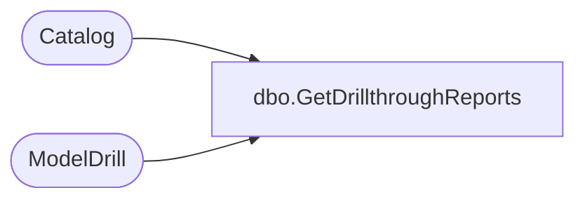

# dbo.GetDrillthroughReports

**Database:** ReportServerESell  
**Server:** bedrockdb01  

## Architecture Diagram



## Table Dependencies

| Referenced Table |
|---|
| Catalog |
| ModelDrill |

## Stored Procedure Code

```sql
CREATE PROCEDURE [dbo].[GetDrillthroughReports]
@ModelID uniqueidentifier,
@ModelItemID nvarchar(425)
AS
 SELECT 
 ModelDrill.Type, 
 Catalog.Path
 FROM ModelDrill INNER JOIN Catalog ON ModelDrill.ReportID = Catalog.ItemID
 WHERE ModelID = @ModelID
 AND ModelItemID = @ModelItemID
```

