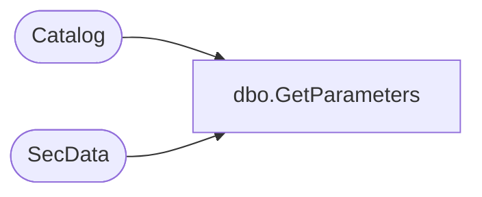

# dbo.GetParameters

**Database:** ReportServerESell  
**Server:** bedrockdb01  

## Architecture Diagram



## Table Dependencies

| Referenced Table |
|---|
| Catalog |
| SecData |

## Stored Procedure Code

```sql
CREATE PROCEDURE [dbo].[GetParameters]
@Path nvarchar (425),
@AuthType int
AS
SELECT
   Type,
   [Parameter],
   ItemID,
   SecData.NtSecDescPrimary,
   [LinkSourceID],
   [ExecutionFlag]
FROM Catalog 
LEFT OUTER JOIN SecData ON Catalog.PolicyID = SecData.PolicyID AND SecData.AuthType = @AuthType
WHERE Path = @Path
```

