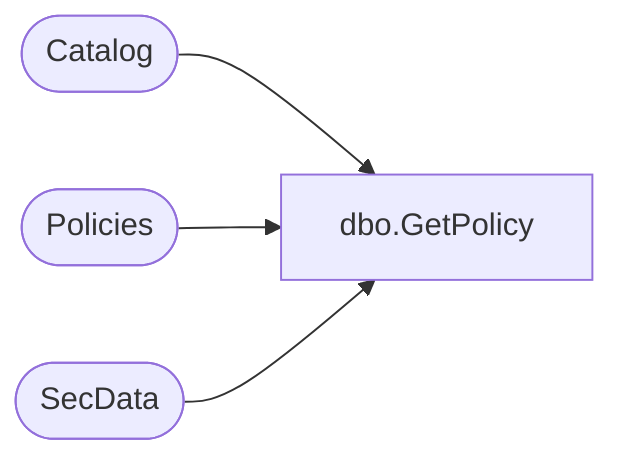

# dbo.GetPolicy

**Database:** ReportServerESell  
**Server:** bedrockdb01  

## Architecture Diagram



## Table Dependencies

| Referenced Table |
|---|
| Catalog |
| Policies |
| SecData |

## Stored Procedure Code

```sql
CREATE PROCEDURE [dbo].[GetPolicy]
@ItemName as nvarchar(425),
@AuthType int
AS 
SELECT SecData.XmlDescription, Catalog.PolicyRoot , SecData.NtSecDescPrimary, Catalog.Type
FROM Catalog 
INNER JOIN Policies ON Catalog.PolicyID = Policies.PolicyID 
LEFT OUTER JOIN SecData ON Policies.PolicyID = SecData.PolicyID AND AuthType = @AuthType
WHERE Catalog.Path = @ItemName
AND PolicyFlag = 0
```

