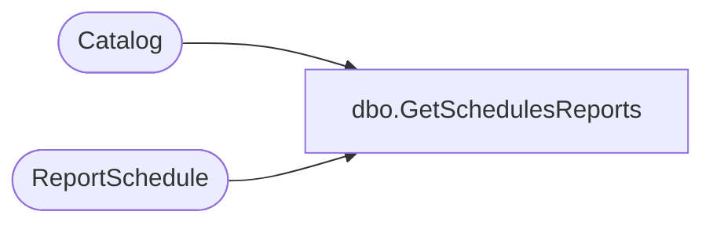

# dbo.GetSchedulesReports

**Database:** ReportServerESell  
**Server:** bedrockdb01  

## Architecture Diagram



## Table Dependencies

| Referenced Table |
|---|
| Catalog |
| ReportSchedule |

## Stored Procedure Code

```sql
CREATE PROCEDURE [dbo].[GetSchedulesReports] 
@ID uniqueidentifier
AS

select 
    C.Path
from
    ReportSchedule RS inner join Catalog C on (C.ItemID = RS.ReportID)
where
    ScheduleID = @ID
```

