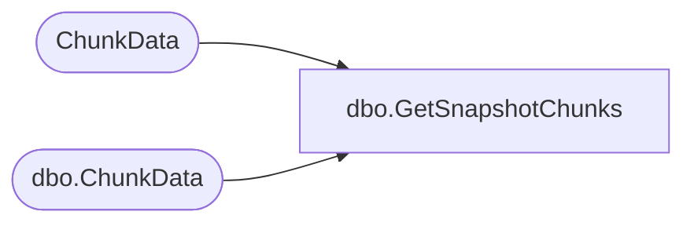

# dbo.GetSnapshotChunks

**Database:** ReportServerESell  
**Server:** bedrockdb01  

## Architecture Diagram



## Table Dependencies

| Referenced Table |
|---|
| ChunkData |
| dbo.ChunkData |

## Stored Procedure Code

```sql
CREATE PROCEDURE [dbo].[GetSnapshotChunks]
@SnapshotDataID uniqueidentifier,
@IsPermanentSnapshot bit
AS

IF @IsPermanentSnapshot != 0 BEGIN

SELECT ChunkName, ChunkType, ChunkFlags, MimeType, Version, datalength(Content)
FROM ChunkData
WHERE   
    SnapshotDataID = @SnapshotDataID
    
END ELSE BEGIN

SELECT ChunkName, ChunkType, ChunkFlags, MimeType, Version, datalength(Content)
FROM [ReportServerESellTempDB].dbo.ChunkData
WHERE   
    SnapshotDataID = @SnapshotDataID
END
```

