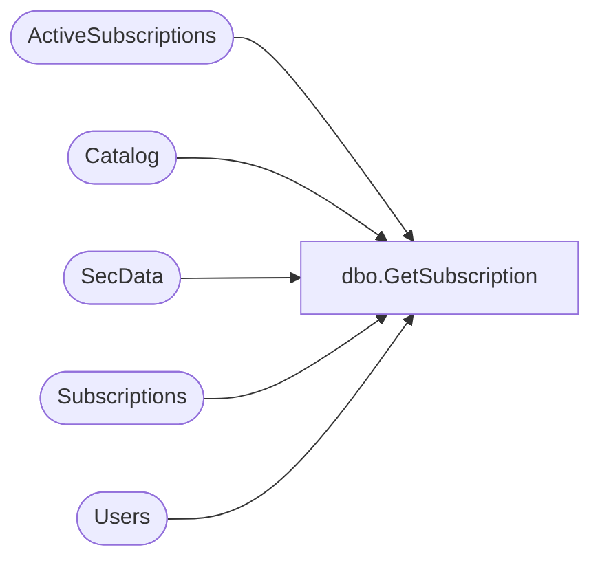

# dbo.GetSubscription

**Database:** ReportServerESell  
**Server:** bedrockdb01  

## Architecture Diagram



## Table Dependencies

| Referenced Table |
|---|
| ActiveSubscriptions |
| Catalog |
| SecData |
| Subscriptions |
| Users |

## Stored Procedure Code

```sql
CREATE PROCEDURE [dbo].[GetSubscription]
@SubscriptionID uniqueidentifier
AS

-- Grab all of the-- subscription properties given a id 
select 
        S.[SubscriptionID],
        S.[Report_OID],
        S.[ReportZone],
        S.[Locale],
        S.[InactiveFlags],
        S.[DeliveryExtension], 
        S.[ExtensionSettings],
        SUSER_SNAME(Modified.[Sid]), 
        Modified.[UserName],
        S.[ModifiedDate], 
        S.[Description],
        S.[LastStatus],
        S.[EventType],
        S.[MatchData],
        S.[Parameters],
        S.[DataSettings],
        A.[TotalNotifications],
        A.[TotalSuccesses],
        A.[TotalFailures],
        SUSER_SNAME(Owner.[Sid]),
        Owner.[UserName],
        CAT.[Path],
        S.[LastRunTime],
        CAT.[Type],
        SD.NtSecDescPrimary,
        S.[Version],
        Owner.[AuthType]
from
    [Subscriptions] S inner join [Catalog] CAT on S.[Report_OID] = CAT.[ItemID]
    inner join [Users] Owner on S.OwnerID = Owner.UserID
    inner join [Users] Modified on S.ModifiedByID = Modified.UserID
    left outer join [SecData] SD on CAT.PolicyID = SD.PolicyID AND SD.AuthType = Owner.AuthType
    left outer join (select top(1) * from [ActiveSubscriptions] with(NOLOCK) where [SubscriptionID] = @SubscriptionID) A on S.[SubscriptionID] = A.[SubscriptionID]
where
    S.[SubscriptionID] = @SubscriptionID
```

