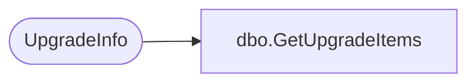

# dbo.GetUpgradeItems

**Database:** ReportServerESell  
**Server:** bedrockdb01  

## Architecture Diagram



## Table Dependencies

| Referenced Table |
|---|
| UpgradeInfo |

## Stored Procedure Code

```sql
CREATE PROCEDURE [dbo].[GetUpgradeItems]
AS
SELECT 
    [Item],
    [Status]
FROM 
    [UpgradeInfo]
```

