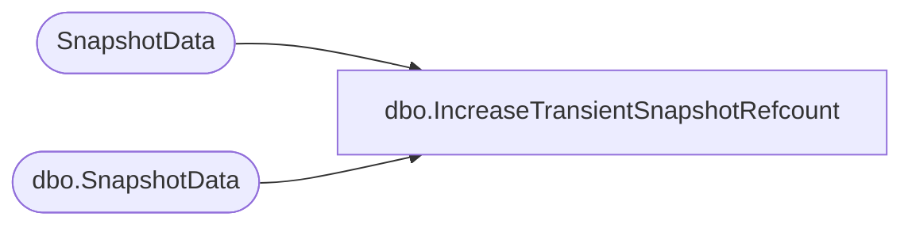

# dbo.IncreaseTransientSnapshotRefcount

**Database:** ReportServerESell  
**Server:** bedrockdb01  

## Architecture Diagram



## Table Dependencies

| Referenced Table |
|---|
| SnapshotData |
| dbo.SnapshotData |

## Stored Procedure Code

```sql
CREATE PROCEDURE [dbo].[IncreaseTransientSnapshotRefcount]
@SnapshotDataID as uniqueidentifier,
@IsPermanentSnapshot as bit,
@ExpirationMinutes as int
AS
SET NOCOUNT OFF
DECLARE @soon AS datetime
SET @soon = DATEADD(n, @ExpirationMinutes, GETDATE())

if @IsPermanentSnapshot = 1
BEGIN
   UPDATE SnapshotData
   SET ExpirationDate = @soon, TransientRefcount = TransientRefcount + 1
   WHERE SnapshotDataID = @SnapshotDataID
END ELSE BEGIN
   UPDATE [ReportServerESellTempDB].dbo.SnapshotData
   SET ExpirationDate = @soon, TransientRefcount = TransientRefcount + 1
   WHERE SnapshotDataID = @SnapshotDataID
END
```

