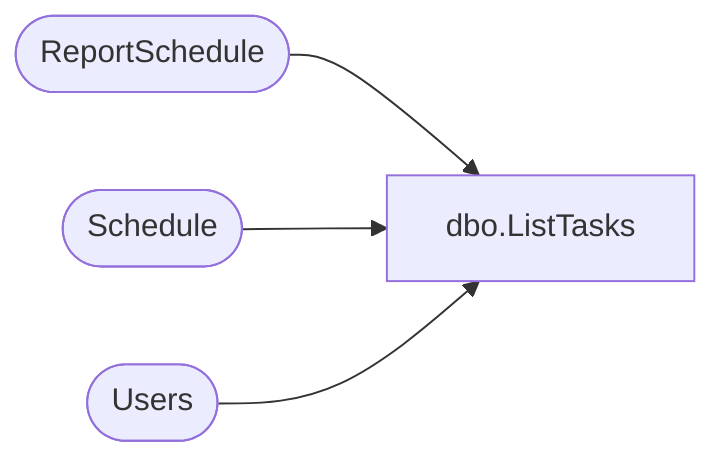

# dbo.ListTasks

**Database:** ReportServerESell  
**Server:** bedrockdb01  

## Architecture Diagram



## Table Dependencies

| Referenced Table |
|---|
| ReportSchedule |
| Schedule |
| Users |

## Stored Procedure Code

```sql
CREATE PROCEDURE [dbo].[ListTasks]
@Path nvarchar (425) = NULL,
@Prefix nvarchar (425) = NULL
AS

select 
        S.[ScheduleID],
        S.[Name],
        S.[StartDate],
        S.[Flags],
        S.[NextRunTime],
        S.[LastRunTime],
        S.[EndDate],
        S.[RecurrenceType],
        S.[MinutesInterval],
        S.[DaysInterval],
        S.[WeeksInterval],
        S.[DaysOfWeek],
        S.[DaysOfMonth],
        S.[Month],
        S.[MonthlyWeek],
        S.[State], 
        S.[LastRunStatus],
        S.[ScheduledRunTimeout],
        S.[EventType],
        S.[EventData],
        S.[Type],
        S.[Path],
        SUSER_SNAME(Owner.[Sid]),
        Owner.[UserName],
        Owner.[AuthType],
        (select count(*) from ReportSchedule where ReportSchedule.ScheduleID = S.ScheduleID)
from
    [Schedule] S  inner join [Users] Owner on S.[CreatedById] = Owner.UserID
where
    S.[Type] = 0 /*Type 0 is shared schedules*/ and
    ((@Path is null) OR (S.Path = @Path) or (S.Path like @Prefix escape '*'))
```

