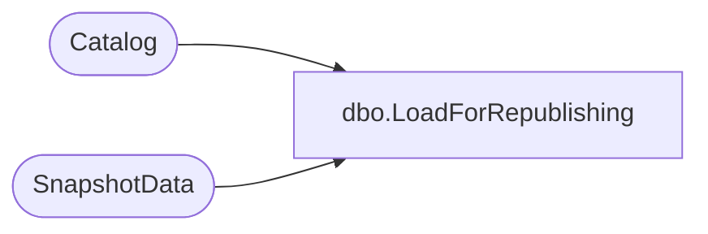

# dbo.LoadForRepublishing

**Database:** ReportServerESell  
**Server:** bedrockdb01  

## Architecture Diagram



## Table Dependencies

| Referenced Table |
|---|
| Catalog |
| SnapshotData |

## Stored Procedure Code

```sql
-- Loads a report's RDL for republishing
CREATE PROCEDURE [dbo].[LoadForRepublishing]
@Path		nvarchar(425)
AS
SELECT 
	COALESCE(LinkTarget.Content, MainItem.Content) AS [Content], 
	CompiledDefinition.SnapshotDataID, 
	CompiledDefinition.ProcessingFlags
FROM Catalog MainItem
LEFT OUTER JOIN Catalog LinkTarget WITH (INDEX = PK_CATALOG) ON (MainItem.LinkSourceID = LinkTarget.ItemID)
JOIN SnapshotData CompiledDefinition ON (CompiledDefinition.SnapshotDataID = COALESCE(LinkTarget.Intermediate, MainItem.Intermediate))
WHERE MainItem.Path = @Path
```

