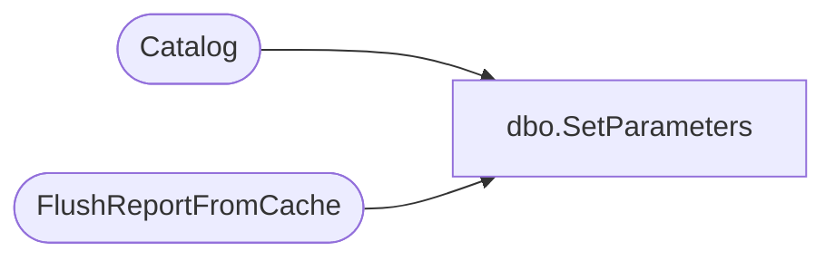

# dbo.SetParameters

**Database:** ReportServerESell  
**Server:** bedrockdb01  

## Architecture Diagram



## Table Dependencies

| Referenced Table |
|---|
| Catalog |
| FlushReportFromCache |

## Stored Procedure Code

```sql
CREATE PROCEDURE [dbo].[SetParameters]
@Path nvarchar (425),
@Parameter ntext
AS
UPDATE Catalog
SET [Parameter] = @Parameter
WHERE Path = @Path
EXEC FlushReportFromCache @Path
```

