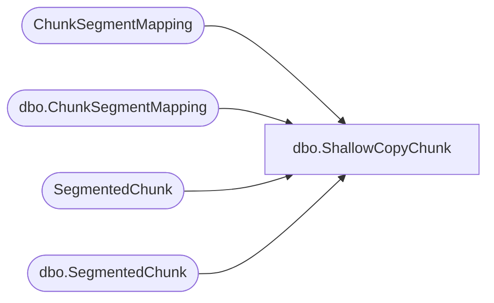

# dbo.ShallowCopyChunk

**Database:** ReportServerESell  
**Server:** bedrockdb01  

## Architecture Diagram



## Table Dependencies

| Referenced Table |
|---|
| ChunkSegmentMapping |
| dbo.ChunkSegmentMapping |
| SegmentedChunk |
| dbo.SegmentedChunk |

## Stored Procedure Code

```sql
create proc [dbo].[ShallowCopyChunk]
	@SnapshotId		uniqueidentifier, 
	@ChunkId		uniqueidentifier, 	
	@IsPermanent	bit, 
	@Machine		nvarchar(512),
	@NewChunkId		uniqueidentifier out
as
begin
	-- @SnapshotId & @ChunkId are the old identifiers	
	-- build the chunksegmentmapping first to prevent race 
	-- condition with cleaning it up
	select @NewChunkId = newid() ;
	if (@IsPermanent = 1) begin		
		insert ChunkSegmentMapping (ChunkId, SegmentId, StartByte, LogicalByteCount, ActualByteCount)
		select @NewChunkId, SegmentId, StartByte, LogicalByteCount, ActualByteCount
		from ChunkSegmentMapping where ChunkId = @ChunkId ;		
		
		update SegmentedChunk
		set ChunkId = @NewChunkId
		where ChunkId = @ChunkId and SnapshotDataId = @SnapshotId		
	end
	else begin
		insert [ReportServerESellTempDB].dbo.ChunkSegmentMapping (ChunkId, SegmentId, StartByte, LogicalByteCount, ActualByteCount)
		select @NewChunkId, SegmentId, StartByte, LogicalByteCount, ActualByteCount
		from [ReportServerESellTempDB].dbo.ChunkSegmentMapping where ChunkId = @ChunkId ;		
		
		-- update the machine name also, this is only really useful 
		-- for file system chunks, in which case the snapshot should
		-- have been versioned on the initial update
		update [ReportServerESellTempDB].dbo.SegmentedChunk
		set 
			ChunkId = @NewChunkId, 
			Machine = @Machine
		where ChunkId = @ChunkId and SnapshotDataId = @SnapshotId			
	end
end
```

