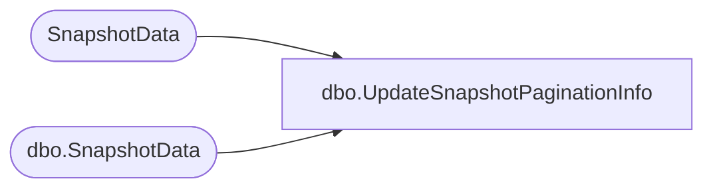

# dbo.UpdateSnapshotPaginationInfo

**Database:** ReportServerESell  
**Server:** bedrockdb01  

## Architecture Diagram



## Table Dependencies

| Referenced Table |
|---|
| SnapshotData |
| dbo.SnapshotData |

## Stored Procedure Code

```sql
CREATE PROCEDURE [dbo].[UpdateSnapshotPaginationInfo]
@SnapshotDataID as uniqueidentifier, 
@IsPermanentSnapshot as bit, 
@PageCount as int,
@PaginationMode as smallint
AS
IF @IsPermanentSnapshot = 1
BEGIN
   UPDATE SnapshotData SET 
	PageCount = @PageCount, 	
	PaginationMode = @PaginationMode
   WHERE SnapshotDataID = @SnapshotDataID
END ELSE BEGIN
   UPDATE [ReportServerESellTempDB].dbo.SnapshotData SET 
	PageCount = @PageCount, 	
	PaginationMode = @PaginationMode
   WHERE SnapshotDataID = @SnapshotDataID
END
```

