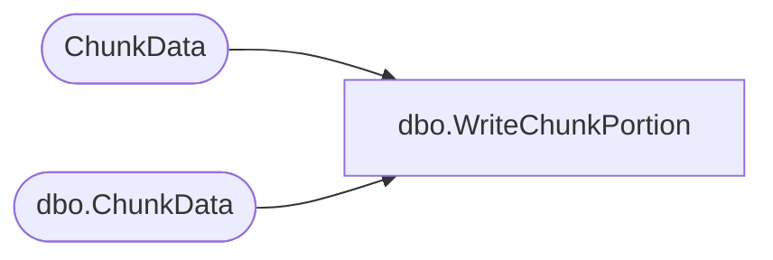

# dbo.WriteChunkPortion

**Database:** ReportServerESell  
**Server:** bedrockdb01  

## Architecture Diagram



## Table Dependencies

| Referenced Table |
|---|
| ChunkData |
| dbo.ChunkData |

## Stored Procedure Code

```sql
CREATE PROCEDURE [dbo].[WriteChunkPortion]
@ChunkPointer binary(16),
@IsPermanentSnapshot bit,
@DataIndex int = NULL,
@DeleteLength int = NULL,
@Content image
AS

IF @IsPermanentSnapshot != 0 BEGIN
    UPDATETEXT ChunkData.Content @ChunkPointer @DataIndex @DeleteLength @Content
END ELSE BEGIN
    UPDATETEXT [ReportServerESellTempDB].dbo.ChunkData.Content @ChunkPointer @DataIndex @DeleteLength @Content
END
```

