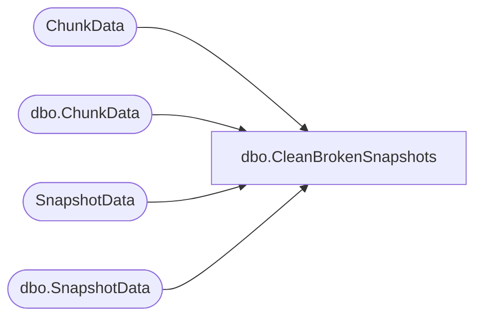

# dbo.CleanBrokenSnapshots

**Database:** ReportServerSA  
**Server:** bedrockdb01  

## Architecture Diagram



## Table Dependencies

| Referenced Table |
|---|
| ChunkData |
| dbo.ChunkData |
| SnapshotData |
| dbo.SnapshotData |

## Stored Procedure Code

```sql
CREATE PROCEDURE [dbo].[CleanBrokenSnapshots]
@Machine nvarchar(512),
@SnapshotsCleaned int OUTPUT,
@ChunksCleaned int OUTPUT,
@TempSnapshotID uniqueidentifier OUTPUT
AS
    SET DEADLOCK_PRIORITY LOW
    DECLARE @now AS datetime
    SELECT @now = GETDATE()
    
    CREATE TABLE #tempSnapshot (SnapshotDataID uniqueidentifier)
    INSERT INTO #tempSnapshot SELECT TOP 1 SnapshotDataID 
    FROM SnapshotData  WITH (NOLOCK) 
    where SnapshotData.PermanentRefcount <= 0 
    AND ExpirationDate < @now
    SET @SnapshotsCleaned = @@ROWCOUNT

    DELETE ChunkData FROM ChunkData INNER JOIN #tempSnapshot
    ON ChunkData.SnapshotDataID = #tempSnapshot.SnapshotDataID
    SET @ChunksCleaned = @@ROWCOUNT

    DELETE SnapshotData FROM SnapshotData INNER JOIN #tempSnapshot
    ON SnapshotData.SnapshotDataID = #tempSnapshot.SnapshotDataID
    
    TRUNCATE TABLE #tempSnapshot

    INSERT INTO #tempSnapshot SELECT TOP 1 SnapshotDataID 
    FROM [ReportServerSATempDB].dbo.SnapshotData  WITH (NOLOCK) 
    where [ReportServerSATempDB].dbo.SnapshotData.PermanentRefcount <= 0 
    AND [ReportServerSATempDB].dbo.SnapshotData.ExpirationDate < @now
    AND [ReportServerSATempDB].dbo.SnapshotData.Machine = @Machine
    SET @SnapshotsCleaned = @SnapshotsCleaned + @@ROWCOUNT

    SELECT @TempSnapshotID = (SELECT SnapshotDataID FROM #tempSnapshot)

    DELETE [ReportServerSATempDB].dbo.ChunkData FROM [ReportServerSATempDB].dbo.ChunkData INNER JOIN #tempSnapshot
    ON [ReportServerSATempDB].dbo.ChunkData.SnapshotDataID = #tempSnapshot.SnapshotDataID
    SET @ChunksCleaned = @ChunksCleaned + @@ROWCOUNT

    DELETE [ReportServerSATempDB].dbo.SnapshotData FROM [ReportServerSATempDB].dbo.SnapshotData INNER JOIN #tempSnapshot
    ON [ReportServerSATempDB].dbo.SnapshotData.SnapshotDataID = #tempSnapshot.SnapshotDataID
```

