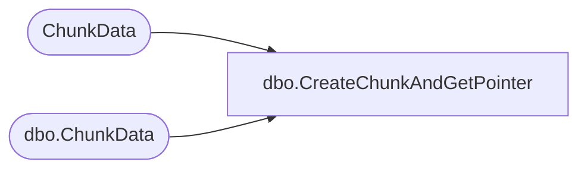

# dbo.CreateChunkAndGetPointer

**Database:** ReportServerSA  
**Server:** bedrockdb01  

## Architecture Diagram



## Table Dependencies

| Referenced Table |
|---|
| ChunkData |
| dbo.ChunkData |

## Stored Procedure Code

```sql
CREATE PROCEDURE [dbo].[CreateChunkAndGetPointer]
@SnapshotDataID uniqueidentifier,
@IsPermanentSnapshot bit,
@ChunkName nvarchar(260),
@ChunkType int,
@MimeType nvarchar(260) = NULL,
@Version smallint,
@Content image,
@ChunkFlags tinyint = NULL,
@ChunkPointer binary(16) OUTPUT
AS

DECLARE @ChunkID uniqueidentifier
SET @ChunkID = NEWID()

IF @IsPermanentSnapshot != 0 BEGIN

    DELETE ChunkData
    WHERE
        SnapshotDataID = @SnapshotDataID AND
        ChunkName = @ChunkName AND
        ChunkType = @ChunkType

    INSERT
    INTO ChunkData
        (ChunkID, SnapshotDataID, ChunkName, ChunkType, MimeType, Version, ChunkFlags, Content)
    VALUES
        (@ChunkID, @SnapshotDataID, @ChunkName, @ChunkType, @MimeType, @Version, @ChunkFlags, @Content)

    SELECT @ChunkPointer = TEXTPTR(Content)
                FROM ChunkData
                WHERE ChunkData.ChunkID = @ChunkID

END ELSE BEGIN

    DELETE [ReportServerSATempDB].dbo.ChunkData
    WHERE
        SnapshotDataID = @SnapshotDataID AND
        ChunkName = @ChunkName AND
        ChunkType = @ChunkType

    INSERT
    INTO [ReportServerSATempDB].dbo.ChunkData
        (ChunkID, SnapshotDataID, ChunkName, ChunkType, MimeType, Version, ChunkFlags, Content)
    VALUES
        (@ChunkID, @SnapshotDataID, @ChunkName, @ChunkType, @MimeType, @Version, @ChunkFlags, @Content)

    SELECT @ChunkPointer = TEXTPTR(Content)
                FROM [ReportServerSATempDB].dbo.ChunkData AS CH
                WHERE CH.ChunkID = @ChunkID
END
```

