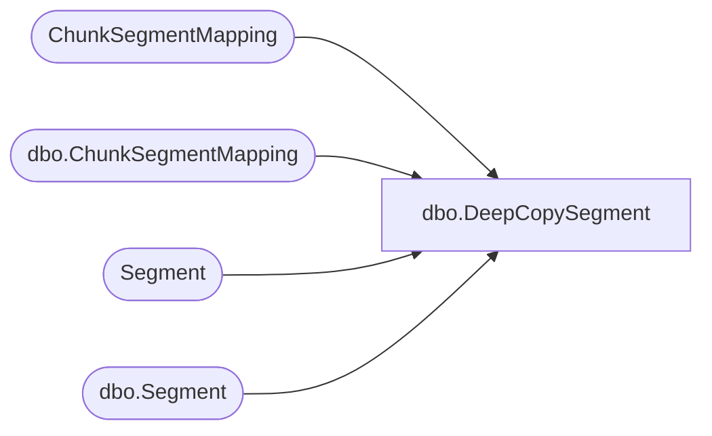

# dbo.DeepCopySegment

**Database:** ReportServerSA  
**Server:** bedrockdb01  

## Architecture Diagram



## Table Dependencies

| Referenced Table |
|---|
| ChunkSegmentMapping |
| dbo.ChunkSegmentMapping |
| Segment |
| dbo.Segment |

## Stored Procedure Code

```sql
create proc [dbo].[DeepCopySegment]
	@ChunkId		uniqueidentifier,
	@IsPermanent	bit,
	@SegmentId		uniqueidentifier,
	@NewSegmentId	uniqueidentifier out
as
begin
	select @NewSegmentId = newid() ;
	if (@IsPermanent = 1) begin
		insert Segment(SegmentId, Content)
		select @NewSegmentId, seg.Content
		from Segment seg
		where seg.SegmentId = @SegmentId ;
				
		update ChunkSegmentMapping
		set SegmentId = @NewSegmentId
		where ChunkId = @ChunkId and SegmentId = @SegmentId ;
	end
	else begin
		insert [ReportServerSATempDB].dbo.Segment(SegmentId, Content)
		select @NewSegmentId, seg.Content
		from [ReportServerSATempDB].dbo.Segment seg
		where seg.SegmentId = @SegmentId ;
		
		update [ReportServerSATempDB].dbo.ChunkSegmentMapping
		set SegmentId = @NewSegmentId
		where ChunkId = @ChunkId and SegmentId = @SegmentId ; 
	end
end
```

