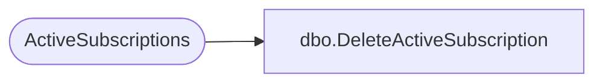

# dbo.DeleteActiveSubscription

**Database:** ReportServerSA  
**Server:** bedrockdb01  

## Architecture Diagram



## Table Dependencies

| Referenced Table |
|---|
| ActiveSubscriptions |

## Stored Procedure Code

```sql
CREATE PROCEDURE [dbo].[DeleteActiveSubscription]
@ActiveID uniqueidentifier
AS

delete from ActiveSubscriptions where ActiveID = @ActiveID
```

