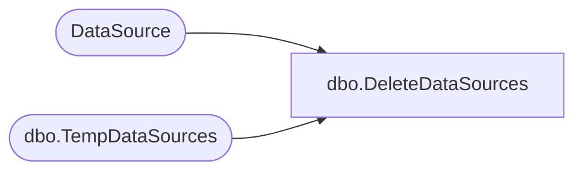

# dbo.DeleteDataSources

**Database:** ReportServerSA  
**Server:** bedrockdb01  

## Architecture Diagram



## Table Dependencies

| Referenced Table |
|---|
| DataSource |
| dbo.TempDataSources |

## Stored Procedure Code

```sql
CREATE PROCEDURE [dbo].[DeleteDataSources]
@ItemID [uniqueidentifier]
AS

DELETE
FROM [DataSource]
WHERE [ItemID] = @ItemID or [SubscriptionID] = @ItemID 
DELETE
FROM [ReportServerSATempDB].dbo.TempDataSources
WHERE [ItemID] = @ItemID
```

