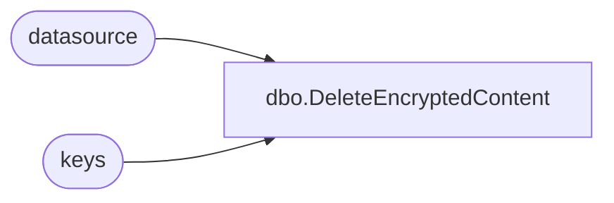

# dbo.DeleteEncryptedContent

**Database:** ReportServerSA  
**Server:** bedrockdb01  

## Architecture Diagram



## Table Dependencies

| Referenced Table |
|---|
| datasource |
| keys |

## Stored Procedure Code

```sql
CREATE PROCEDURE [dbo].[DeleteEncryptedContent]
AS

-- Remove the encryption keys
delete from keys where client >= 0

-- Remove the encrypted content
update datasource
set CredentialRetrieval = 1, -- CredentialRetrieval.Prompt
    ConnectionString = null,
    OriginalConnectionString = null,
    UserName = null,
    Password = null
```

