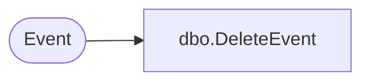

# dbo.DeleteEvent

**Database:** ReportServerSA  
**Server:** bedrockdb01  

## Architecture Diagram



## Table Dependencies

| Referenced Table |
|---|
| Event |

## Stored Procedure Code

```sql
CREATE PROCEDURE [dbo].[DeleteEvent] 
@ID uniqueidentifier
AS
delete from [Event] where [EventID] = @ID
```

