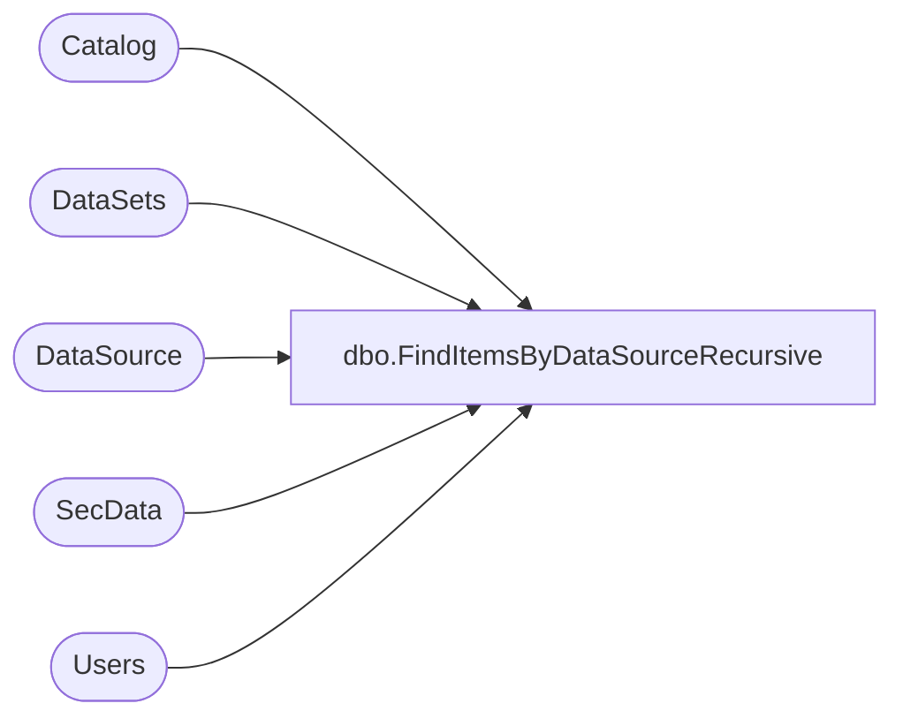

# dbo.FindItemsByDataSourceRecursive

**Database:** ReportServerSA  
**Server:** bedrockdb01  

## Architecture Diagram



## Table Dependencies

| Referenced Table |
|---|
| Catalog |
| DataSets |
| DataSource |
| SecData |
| Users |

## Stored Procedure Code

```sql
CREATE PROCEDURE [dbo].[FindItemsByDataSourceRecursive]
@ItemID uniqueidentifier,
@AuthType int
AS
SELECT 
    C.Type,
    C.PolicyID,
    SD.NtSecDescPrimary,
    C.Name, 
    C.Path, 
    C.ItemID,
    DATALENGTH( C.Content ) AS [Size],
    C.Description,
    C.CreationDate, 
    C.ModifiedDate,
    SUSER_SNAME(CU.Sid), 
    CU.UserName,
    SUSER_SNAME(MU.Sid),
    MU.UserName,
    C.MimeType,
    C.ExecutionTime,
    C.Hidden,
    C.SubType,
    C.ComponentID
FROM
   Catalog AS C 
   INNER JOIN Users AS CU ON C.CreatedByID = CU.UserID
   INNER JOIN Users AS MU ON C.ModifiedByID = MU.UserID
   LEFT OUTER JOIN SecData AS SD ON C.PolicyID = SD.PolicyID AND SD.AuthType = @AuthType
   INNER JOIN 
   (
		SELECT ItemID FROM DataSource 
		WHERE Link = @ItemID 
		UNION 
		SELECT ItemID FROM DataSets
		WHERE LinkID IN
		(
			SELECT D1.ItemID
			FROM DataSource D1
			WHERE D1.Link = @ItemID
		)
	)
   AS DS ON C.ItemID = DS.ItemID
```

