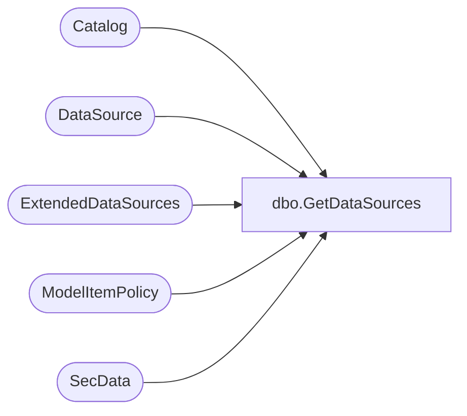

# dbo.GetDataSources

**Database:** ReportServerSA  
**Server:** bedrockdb01  

## Architecture Diagram



## Table Dependencies

| Referenced Table |
|---|
| Catalog |
| DataSource |
| ExtendedDataSources |
| ModelItemPolicy |
| SecData |

## Stored Procedure Code

```sql
CREATE  PROCEDURE [dbo].[GetDataSources]
@ItemID [uniqueidentifier],
@AuthType int
AS
BEGIN

SELECT -- select data sources and their links (if they exist)
    DS.[DSID],      -- 0
    DS.[ItemID],    -- 1
    DS.[Name],      -- 2
    DS.[Extension], -- 3
    DS.[Link],      -- 4
    DS.[CredentialRetrieval], -- 5
    DS.[Prompt],    -- 6
    DS.[ConnectionString], -- 7
    DS.[OriginalConnectionString], -- 8
    DS.[UserName],  -- 9
    DS.[Password],  -- 10
    DS.[Flags],     -- 11
    DSL.[DSID],     -- 12
    DSL.[ItemID],   -- 13
    DSL.[Name],     -- 14
    DSL.[Extension], -- 15
    DSL.[Link],     -- 16
    DSL.[CredentialRetrieval], -- 17
    DSL.[Prompt],   -- 18
    DSL.[ConnectionString], -- 19
    DSL.[UserName], -- 20
    DSL.[Password], -- 21
    DSL.[Flags],	-- 22
    C.Path,         -- 23
    SD.NtSecDescPrimary, -- 24
    DS.[OriginalConnectStringExpressionBased], -- 25
    DS.[Version], -- 26
    DSL.[Version], -- 27
    (SELECT 1 WHERE EXISTS (SELECT * from [ModelItemPolicy] AS MIP WHERE C.[ItemID] = MIP.[CatalogItemID])) -- 28
FROM
   ExtendedDataSources AS DS 
   LEFT OUTER JOIN 
    (DataSource AS DSL
     INNER JOIN Catalog C ON DSL.[ItemID] = C.[ItemID]
       LEFT OUTER JOIN [SecData] AS SD ON C.[PolicyID] = SD.[PolicyID] AND SD.AuthType = @AuthType)
   ON DS.[Link] = DSL.[ItemID]
WHERE
   DS.[ItemID] = @ItemID or DS.[SubscriptionID] = @ItemID
END
```

