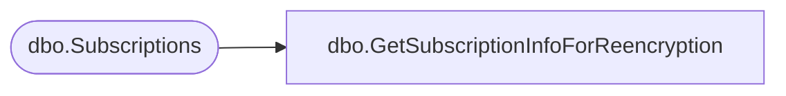

# dbo.GetSubscriptionInfoForReencryption

**Database:** ReportServerSA  
**Server:** bedrockdb01  

## Architecture Diagram



## Table Dependencies

| Referenced Table |
|---|
| dbo.Subscriptions |

## Stored Procedure Code

```sql
CREATE PROCEDURE [dbo].[GetSubscriptionInfoForReencryption]
@SubscriptionID as uniqueidentifier
AS

SELECT [DeliveryExtension], [ExtensionSettings], [Version]
FROM [dbo].[Subscriptions]
WHERE [SubscriptionID] = @SubscriptionID
```

