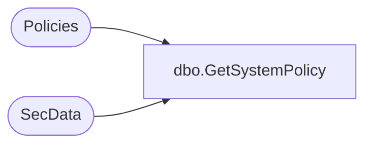

# dbo.GetSystemPolicy

**Database:** ReportServerSA  
**Server:** bedrockdb01  

## Architecture Diagram



## Table Dependencies

| Referenced Table |
|---|
| Policies |
| SecData |

## Stored Procedure Code

```sql
CREATE PROCEDURE [dbo].[GetSystemPolicy]
@AuthType int
AS 
SELECT SecData.NtSecDescPrimary, SecData.XmlDescription
FROM Policies 
LEFT OUTER JOIN SecData ON Policies.PolicyID = SecData.PolicyID AND AuthType = @AuthType
WHERE PolicyFlag = 1
```

