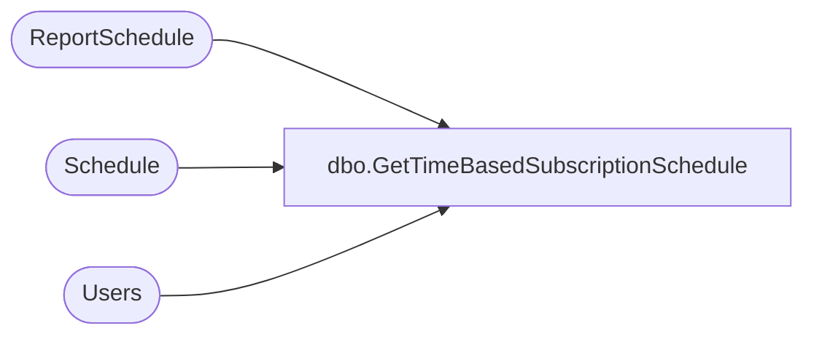

# dbo.GetTimeBasedSubscriptionSchedule

**Database:** ReportServerSA  
**Server:** bedrockdb01  

## Architecture Diagram



## Table Dependencies

| Referenced Table |
|---|
| ReportSchedule |
| Schedule |
| Users |

## Stored Procedure Code

```sql
CREATE PROCEDURE [dbo].[GetTimeBasedSubscriptionSchedule]
@SubscriptionID as uniqueidentifier
AS

select
    S.[ScheduleID],
    S.[Name],
    S.[StartDate], 
    S.[Flags],
    S.[NextRunTime],
    S.[LastRunTime], 
    S.[EndDate], 
    S.[RecurrenceType],
    S.[MinutesInterval], 
    S.[DaysInterval],
    S.[WeeksInterval],
    S.[DaysOfWeek], 
    S.[DaysOfMonth], 
    S.[Month], 
    S.[MonthlyWeek], 
    S.[State], 
    S.[LastRunStatus],
    S.[ScheduledRunTimeout],
    S.[EventType],
    S.[EventData],
    S.[Type],
    S.[Path],
    SUSER_SNAME(Owner.[Sid]),
    Owner.[UserName],
    Owner.[AuthType]
from
    [ReportSchedule] R inner join Schedule S with (XLOCK) on R.[ScheduleID] = S.[ScheduleID]
    Inner join [Users] Owner on S.[CreatedById] = Owner.UserID
where
    R.[SubscriptionID] = @SubscriptionID
```

