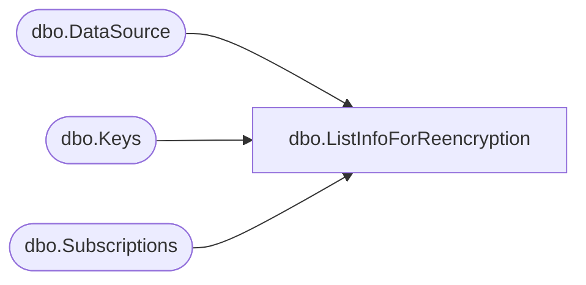

# dbo.ListInfoForReencryption

**Database:** ReportServerSA  
**Server:** bedrockdb01  

## Architecture Diagram



## Table Dependencies

| Referenced Table |
|---|
| dbo.DataSource |
| dbo.Keys |
| dbo.Subscriptions |

## Stored Procedure Code

```sql
CREATE PROCEDURE [dbo].[ListInfoForReencryption]
AS

SELECT [DSID]
FROM [dbo].[DataSource] WITH (XLOCK, TABLOCK)

SELECT [SubscriptionID]
FROM [dbo].[Subscriptions] WITH (XLOCK, TABLOCK)

SELECT [InstallationID], [PublicKey]
FROM [dbo].[Keys] WITH (XLOCK, TABLOCK)
WHERE [Client] = 1 AND ([SymmetricKey] IS NOT NULL)
```

