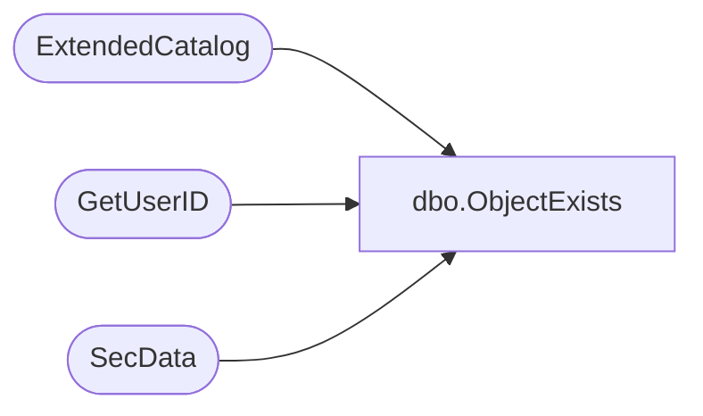

# dbo.ObjectExists

**Database:** ReportServerSA  
**Server:** bedrockdb01  

## Architecture Diagram



## Table Dependencies

| Referenced Table |
|---|
| ExtendedCatalog |
| GetUserID |
| SecData |

## Stored Procedure Code

```sql
CREATE PROCEDURE [dbo].[ObjectExists]
@Path nvarchar (425),
@EditSessionID varchar(32) = NULL,
@OwnerSid as varbinary(85) = NULL, 
@OwnerName as nvarchar(260) = NULL,
@AuthType int
AS
BEGIN
DECLARE @OwnerID uniqueidentifier
if(@EditSessionID is not null)
BEGIN
    EXEC GetUserID @OwnerSid, @OwnerName, @AuthType, @OwnerID OUTPUT
END

SELECT Type, ItemID, SnapshotLimit, NtSecDescPrimary, ExecutionFlag, Intermediate, [LinkSourceID], SubType, ComponentID
FROM ExtendedCatalog(@OwnerID, @Path, @EditSessionID)
LEFT OUTER JOIN SecData
ON ExtendedCatalog.PolicyID = SecData.PolicyID AND SecData.AuthType = @AuthType
END
```

