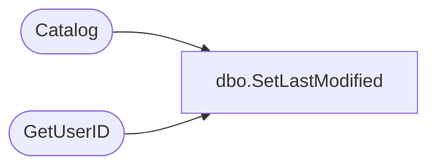

# dbo.SetLastModified

**Database:** ReportServerSA  
**Server:** bedrockdb01  

## Architecture Diagram



## Table Dependencies

| Referenced Table |
|---|
| Catalog |
| GetUserID |

## Stored Procedure Code

```sql
CREATE PROCEDURE [dbo].[SetLastModified]
@Path nvarchar (425),
@ModifiedBySid varbinary (85) = NULL,
@ModifiedByName nvarchar(260),
@AuthType int,
@ModifiedDate DateTime
AS
DECLARE @ModifiedByID uniqueidentifier
EXEC GetUserID @ModifiedBySid, @ModifiedByName, @AuthType, @ModifiedByID OUTPUT
UPDATE Catalog
SET ModifiedByID = @ModifiedByID, ModifiedDate = @ModifiedDate
WHERE Path = @Path
```

