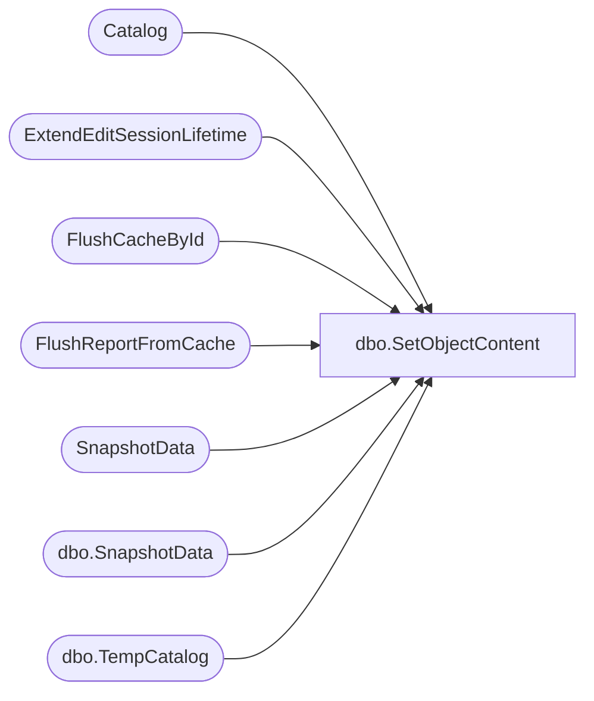

# dbo.SetObjectContent

**Database:** ReportServerSA  
**Server:** bedrockdb01  

## Architecture Diagram



## Table Dependencies

| Referenced Table |
|---|
| Catalog |
| ExtendEditSessionLifetime |
| FlushCacheById |
| FlushReportFromCache |
| SnapshotData |
| dbo.SnapshotData |
| dbo.TempCatalog |

## Stored Procedure Code

```sql
CREATE PROCEDURE [dbo].[SetObjectContent]
@Path nvarchar (425),
@EditSessionID varchar(32) = NULL,
@Type int,
@Content image = NULL,
@Intermediate uniqueidentifier = NULL,
@Parameter ntext = NULL,
@LinkSourceID uniqueidentifier = NULL,
@MimeType nvarchar (260) = NULL,
@DataCacheHash varbinary(64) = NULL,
@SubType nvarchar(128) = NULL,
@ComponentID uniqueidentifier= NULL
AS

DECLARE @OldIntermediate as uniqueidentifier
DECLARE @OldPermanent as bit
IF(@EditSessionID is null)
BEGIN	
SET @OldIntermediate = (SELECT Intermediate FROM Catalog WITH (XLOCK) WHERE Path = @Path)

UPDATE SnapshotData
SET PermanentRefcount = PermanentRefcount - 1,
    -- to fix VSTS 384486 keep shared dataset compiled definition for 14 days
    ExpirationDate = case when @Type = 8 then DATEADD(d, 14, GETDATE()) ELSE ExpirationDate END,
    TransientRefcount = TransientRefcount + case when @Type = 8 then 1 ELSE 0 END
WHERE SnapshotData.SnapshotDataID = @OldIntermediate

UPDATE Catalog
SET Type=@Type, Content = @Content, Intermediate = @Intermediate, [Parameter] = @Parameter, LinkSourceID = @LinkSourceID, MimeType = @MimeType, SubType = @SubType, ComponentID = @ComponentID
WHERE Path = @Path

UPDATE SnapshotData
SET PermanentRefcount = PermanentRefcount + 1, TransientRefcount = TransientRefcount - 1
WHERE SnapshotData.SnapshotDataID = @Intermediate

EXEC FlushReportFromCache @Path

END
ELSE
BEGIN
    DECLARE @OldDataCacheHash binary(64) ;
    DECLARE @ItemID uniqueidentifier ;
    
    SELECT	@OldIntermediate = Intermediate, 
            @OldPermanent = IntermediateIsPermanent,
            @OldDataCacheHash = DataCacheHash, 
            @ItemID = TempCatalogID
    FROM [ReportServerSATempDB].dbo.TempCatalog WITH (XLOCK)
    WHERE ContextPath = @Path and EditSessionID = @EditSessionID

    UPDATE [ReportServerSATempDB].dbo.TempCatalog
    SET Content = @Content, 
        Intermediate = @Intermediate, 
        IntermediateIsPermanent = 0, 
        Parameter = @Parameter,
        DataCacheHash = @DataCacheHash
    WHERE ContextPath = @Path and EditSessionID = @EditSessionID
    
    UPDATE [ReportServerSATempDB].dbo.SnapshotData
    SET  PermanentRefcount = PermanentRefcount - 1
    WHERE SnapshotData.SnapshotDataID = @OldIntermediate

    UPDATE [ReportServerSATempDB].dbo.SnapshotData
    SET PermanentRefcount = PermanentRefcount + 1, TransientRefcount = TransientRefcount - 1
    WHERE SnapshotData.SnapshotDataID = @Intermediate 
    
    EXEC ExtendEditSessionLifetime @EditSessionID ;
    
    IF ((@OldDataCacheHash <> @DataCacheHash) OR 
		(@OldDataCacheHash IS NULL) OR 
		(@DataCacheHash IS NULL))
    BEGIN
        EXEC FlushCacheById @ItemID
    END
END
```

