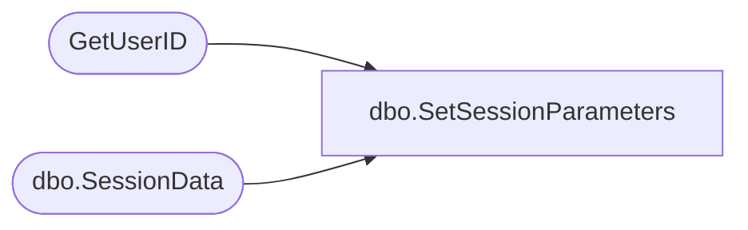

# dbo.SetSessionParameters

**Database:** ReportServerSA  
**Server:** bedrockdb01  

## Architecture Diagram



## Table Dependencies

| Referenced Table |
|---|
| GetUserID |
| dbo.SessionData |

## Stored Procedure Code

```sql
CREATE PROCEDURE [dbo].[SetSessionParameters]
@SessionID as varchar(32),
@OwnerSid as varbinary(85) = NULL,
@OwnerName as nvarchar(260),
@AuthType as int,
@EffectiveParams as ntext = NULL
AS

DECLARE @OwnerID uniqueidentifier
EXEC GetUserID @OwnerSid, @OwnerName, @AuthType, @OwnerID OUTPUT

UPDATE SE
SET
   SE.EffectiveParams = @EffectiveParams,
   SE.AwaitingFirstExecution = 1
FROM
   [ReportServerSATempDB].dbo.SessionData AS SE
WHERE
   SE.SessionID = @SessionID AND
   SE.OwnerID = @OwnerID
```

