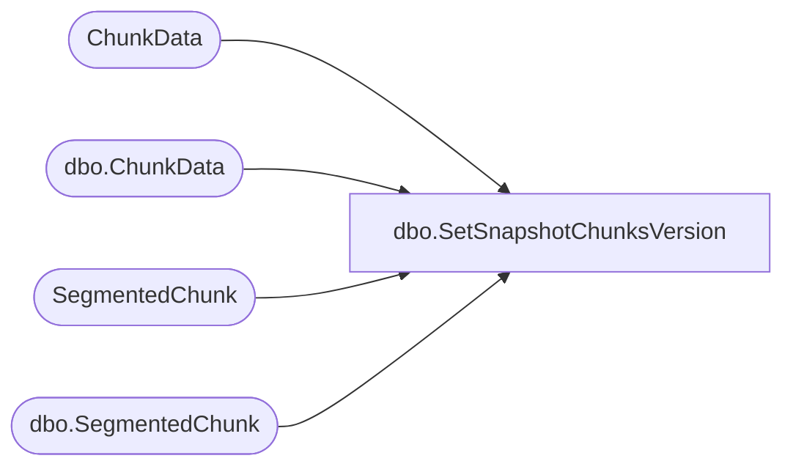

# dbo.SetSnapshotChunksVersion

**Database:** ReportServerSA  
**Server:** bedrockdb01  

## Architecture Diagram



## Table Dependencies

| Referenced Table |
|---|
| ChunkData |
| dbo.ChunkData |
| SegmentedChunk |
| dbo.SegmentedChunk |

## Stored Procedure Code

```sql
CREATE PROCEDURE [dbo].[SetSnapshotChunksVersion]
@SnapshotDataID as uniqueidentifier,
@IsPermanentSnapshot as bit,
@Version as smallint
AS
declare @affectedRows int
set @affectedRows = 0
if @IsPermanentSnapshot = 1
BEGIN
   if @Version > 0
   BEGIN
      UPDATE ChunkData
      SET Version = @Version
      WHERE SnapshotDataID = @SnapshotDataID
      
      SELECT @affectedRows = @affectedRows + @@rowcount
      
      UPDATE SegmentedChunk
      SET Version = @Version
      WHERE SnapshotDataId = @SnapshotDataID      
      
      SELECT @affectedRows = @affectedRows + @@rowcount            
   END ELSE BEGIN
      UPDATE ChunkData
      SET Version = Version
      WHERE SnapshotDataID = @SnapshotDataID
      
      SELECT @affectedRows = @affectedRows + @@rowcount
      
      UPDATE SegmentedChunk
      SET Version = Version
      WHERE SnapshotDataId = @SnapshotDataID
      
      SELECT @affectedRows = @affectedRows + @@rowcount
   END   
END ELSE BEGIN
   if @Version > 0
   BEGIN
      UPDATE [ReportServerSATempDB].dbo.ChunkData
      SET Version = @Version
      WHERE SnapshotDataID = @SnapshotDataID
      
      SELECT @affectedRows = @affectedRows + @@rowcount
      
      UPDATE [ReportServerSATempDB].dbo.SegmentedChunk
      SET Version = @Version
      WHERE SnapshotDataId = @SnapshotDataID    
      
      SELECT @affectedRows = @affectedRows + @@rowcount
   END ELSE BEGIN
      UPDATE [ReportServerSATempDB].dbo.ChunkData
      SET Version = Version
      WHERE SnapshotDataID = @SnapshotDataID
            
      SELECT @affectedRows = @affectedRows + @@rowcount
      
      UPDATE [ReportServerSATempDB].dbo.SegmentedChunk
      SET Version = Version
      WHERE SnapshotDataId = @SnapshotDataID   
      
      SELECT @affectedRows = @affectedRows + @@rowcount
   END      
END
SELECT @affectedRows
```

