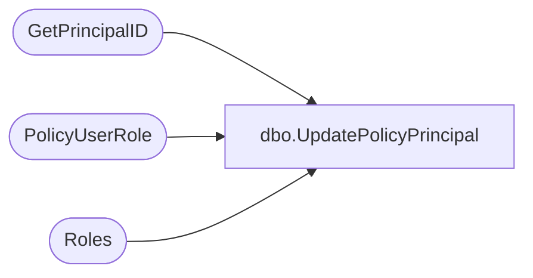

# dbo.UpdatePolicyPrincipal

**Database:** ReportServerSA  
**Server:** bedrockdb01  

## Architecture Diagram



## Table Dependencies

| Referenced Table |
|---|
| GetPrincipalID |
| PolicyUserRole |
| Roles |

## Stored Procedure Code

```sql
CREATE PROCEDURE [dbo].[UpdatePolicyPrincipal]
@PolicyID uniqueidentifier,
@PrincipalSid varbinary(85) = NULL,
@PrincipalName nvarchar(260),
@PrincipalAuthType int,
@RoleName nvarchar(260),
@PrincipalID uniqueidentifier OUTPUT,
@RoleID uniqueidentifier OUTPUT
AS 
EXEC GetPrincipalID @PrincipalSid , @PrincipalName, @PrincipalAuthType, @PrincipalID  OUTPUT
SELECT @RoleID = (SELECT RoleID FROM Roles WHERE RoleName = @RoleName)
INSERT INTO PolicyUserRole 
(ID, RoleID, UserID, PolicyID)
VALUES (newid(), @RoleID, @PrincipalID, @PolicyID)
```

