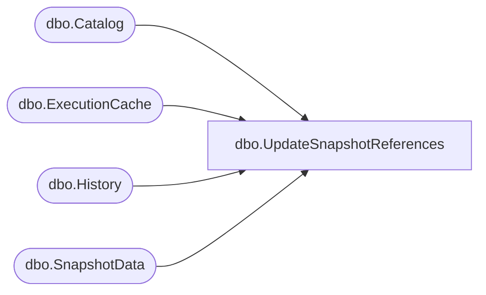

# dbo.UpdateSnapshotReferences

**Database:** ReportServerSA  
**Server:** bedrockdb01  

## Architecture Diagram



## Table Dependencies

| Referenced Table |
|---|
| dbo.Catalog |
| dbo.ExecutionCache |
| dbo.History |
| dbo.SnapshotData |

## Stored Procedure Code

```sql
CREATE PROCEDURE [dbo].[UpdateSnapshotReferences]
	@OldSnapshotId UNIQUEIDENTIFIER, 
	@NewSnapshotId UNIQUEIDENTIFIER,
	@IsPermanentSnapshot BIT,
	@TransientRefCountModifier INT,
	@UpdatedReferences INT OUTPUT	
AS 
BEGIN	
	SET @UpdatedReferences = 0
	
	IF(@IsPermanentSnapshot = 1)
	BEGIN
		-- Update Snapshot Executions		
		UPDATE [dbo].[Catalog]
		SET [SnapshotDataID] = @NewSnapshotId
		WHERE [SnapshotDataID] = @OldSnapshotId

		SELECT @UpdatedReferences = @UpdatedReferences + @@ROWCOUNT

		-- Update History
		UPDATE [dbo].[History]
		SET [SnapshotDataID] = @NewSnapshotId
		WHERE [SnapshotDataID] = @OldSnapshotId

		SELECT @UpdatedReferences = @UpdatedReferences + @@ROWCOUNT

		UPDATE [dbo].[SnapshotData]
		SET [PermanentRefcount] = [PermanentRefcount] - @UpdatedReferences,
			[TransientRefcount] = [TransientRefcount] + @TransientRefCountModifier
		WHERE [SnapshotDataID] = @OldSnapshotId

		UPDATE [dbo].[SnapshotData]
		SET [PermanentRefcount] = [PermanentRefcount] + @UpdatedReferences
		WHERE [SnapshotDataID] = @NewSnapshotId
	END
	ELSE
	BEGIN
		-- Update Execution Cache
		UPDATE [ReportServerSATempDB].dbo.[ExecutionCache]
		SET [SnapshotDataID] = @NewSnapshotId
		WHERE [SnapshotDataID] = @OldSnapshotId
		
		SELECT @UpdatedReferences = @UpdatedReferences + @@ROWCOUNT
		
		UPDATE [ReportServerSATempDB].dbo.[SnapshotData]
		SET [PermanentRefcount] = [PermanentRefcount] - @UpdatedReferences,
			[TransientRefcount] = [TransientRefcount] + @TransientRefCountModifier
		WHERE [SnapshotDataID] = @OldSnapshotId

		UPDATE [ReportServerSATempDB].dbo.[SnapshotData]
		SET [PermanentRefcount] = [PermanentRefcount] + @UpdatedReferences
		WHERE [SnapshotDataID] = @NewSnapshotId
	END
END
```

