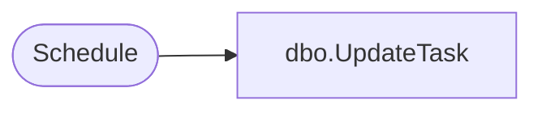

# dbo.UpdateTask

**Database:** ReportServerSA  
**Server:** bedrockdb01  

## Architecture Diagram



## Table Dependencies

| Referenced Table |
|---|
| Schedule |

## Stored Procedure Code

```sql
CREATE PROCEDURE [dbo].[UpdateTask]
@ScheduleID uniqueidentifier,
@Name nvarchar (260),
@StartDate datetime,
@Flags int,
@NextRunTime datetime = NULL,
@LastRunTime datetime = NULL,
@EndDate datetime = NULL,
@RecurrenceType int = NULL,
@MinutesInterval int = NULL,
@DaysInterval int = NULL,
@WeeksInterval int = NULL,
@DaysOfWeek int = NULL,
@DaysOfMonth int = NULL,
@Month int = NULL,
@MonthlyWeek int = NULL,
@State int = NULL,
@LastRunStatus nvarchar (260) = NULL,
@ScheduledRunTimeout int = NULL

AS

-- Update a tasks values. ScheduleID and Report information can not be updated
Update Schedule set
        [StartDate] = @StartDate, 
        [Name] = @Name,
        [Flags] = @Flags,
        [NextRunTime] = @NextRunTime,
        [LastRunTime] = @LastRunTime,
        [EndDate] = @EndDate, 
        [RecurrenceType] = @RecurrenceType, 
        [MinutesInterval] = @MinutesInterval,
        [DaysInterval] = @DaysInterval,
        [WeeksInterval] = @WeeksInterval,
        [DaysOfWeek] = @DaysOfWeek, 
        [DaysOfMonth] = @DaysOfMonth, 
        [Month] = @Month, 
        [MonthlyWeek] = @MonthlyWeek, 
        [State] = @State, 
        [LastRunStatus] = @LastRunStatus,
        [ScheduledRunTimeout] = @ScheduledRunTimeout
where
    [ScheduleID] = @ScheduleID
```

