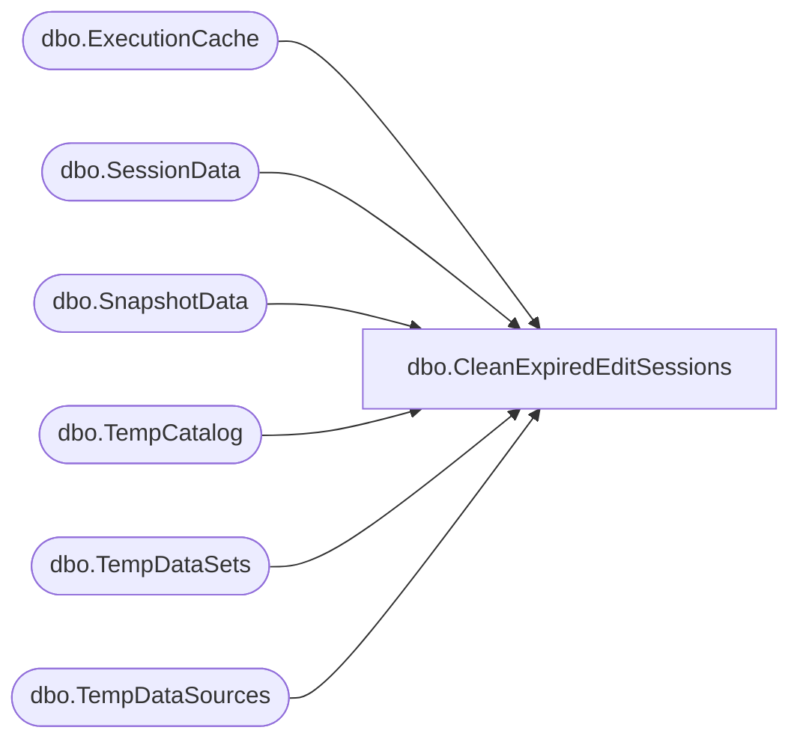

# dbo.CleanExpiredEditSessions

**Database:** ReportServerWebIM  
**Server:** bedrockdb01  

## Architecture Diagram



## Table Dependencies

| Referenced Table |
|---|
| dbo.ExecutionCache |
| dbo.SessionData |
| dbo.SnapshotData |
| dbo.TempCatalog |
| dbo.TempDataSets |
| dbo.TempDataSources |

## Stored Procedure Code

```sql
CREATE PROC [dbo].[CleanExpiredEditSessions]
    @MaxToClean int = 10, 
    @NumCleaned int OUTPUT
AS BEGIN
    SET DEADLOCK_PRIORITY LOW 
    
    declare @now datetime;
    select @now = GETDATE();
    
    declare @DeletedItems table (ItemID uniqueidentifier not null primary key, Intermediate uniqueidentifier null)
    declare @DeletedCacheSnapshots table (SnapshotDataID uniqueidentifier null)
            
    begin transaction
        insert into @DeletedItems 
        select top(@MaxToClean) TempCatalogID, Intermediate
        from [ReportServerWebIMTempDB].dbo.TempCatalog TC WITH(UPDLOCK)
        where ExpirationTime < @now and not exists (
            select 1 
            from [ReportServerWebIMTempDB].dbo.SessionData SD WITH (INDEX (IX_EditSessionID)) 
            where SD.EditSessionID = TC.EditSessionID ) ;
        
        delete from [ReportServerWebIMTempDB].dbo.TempDataSources	
        where ItemID in (
            select ItemID from @DeletedItems ) ;

        delete from [ReportServerWebIMTempDB].dbo.TempDataSets	
        where ItemID in (
            select ItemID from @DeletedItems ) ;
            
        delete from [ReportServerWebIMTempDB].dbo.TempCatalog
        where TempCatalogID in (
            select ItemID from @DeletedItems ) ;
            
        delete from [ReportServerWebIMTempDB].dbo.ExecutionCache		
        output deleted.SnapshotDataID into @DeletedCacheSnapshots(SnapshotDataID)
        where ReportID in (
            select ItemID from @DeletedItems );
            
        update [ReportServerWebIMTempDB].dbo.SnapshotData
        set PermanentRefcount = PermanentRefcount - 1
        where SnapshotData.SnapshotDataID in 
            (select Intermediate from @DeletedItems 
             union 
             select SnapshotDataID from @DeletedCacheSnapshots) ;
    commit
    
    select @NumCleaned = count(1) from @DeletedItems ;
END
```

