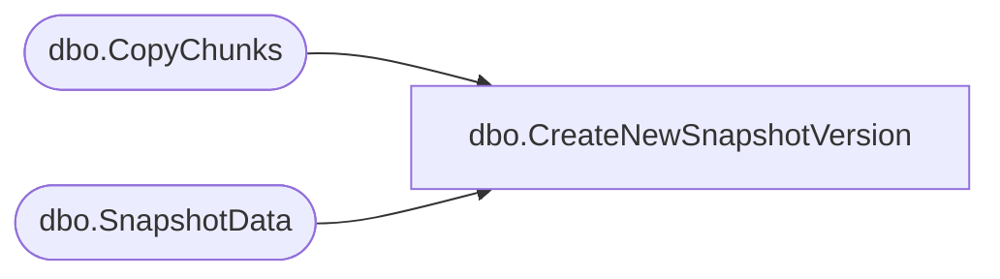

# dbo.CreateNewSnapshotVersion

**Database:** ReportServerWebIM  
**Server:** bedrockdb01  

## Architecture Diagram



## Table Dependencies

| Referenced Table |
|---|
| dbo.CopyChunks |
| dbo.SnapshotData |

## Stored Procedure Code

```sql
CREATE PROCEDURE [dbo].[CreateNewSnapshotVersion]
	@OldSnapshotId UNIQUEIDENTIFIER, 
	@NewSnapshotId UNIQUEIDENTIFIER,
	@IsPermanentSnapshot BIT, 
	@Machine NVARCHAR(512)
AS
BEGIN
	IF(@IsPermanentSnapshot = 1) BEGIN	
		INSERT [dbo].[SnapshotData] (
			SnapshotDataId, 
			CreatedDate, 
			ParamsHash, 
			QueryParams, 
			EffectiveParams, 
			Description, 
			DependsOnUser, 
			PermanentRefCount, 
			TransientRefCount, 
			ExpirationDate, 
			PageCount, 
			HasDocMap, 
			PaginationMode, 
			ProcessingFlags
			)
		SELECT 
			@NewSnapshotId,
			[sn].CreatedDate, 
			[sn].ParamsHash,
			[sn].QueryParams, 
			[sn].EffectiveParams, 
			[sn].Description, 
			[sn].DependsOnUser, 	
			0,
			1,		-- always create with transient refcount of 1
			[sn].ExpirationDate,
			[sn].PageCount, 
			[sn].HasDocMap, 
			[sn].PaginationMode,
			[sn].ProcessingFlags
		FROM [dbo].[SnapshotData] [sn] 
		WHERE [sn].SnapshotDataId = @OldSnapshotId
	END
	ELSE BEGIN	
		INSERT [ReportServerWebIMTempDB].dbo.[SnapshotData] (
			SnapshotDataId, 
			CreatedDate, 
			ParamsHash, 
			QueryParams, 
			EffectiveParams, 
			Description, 
			DependsOnUser, 
			PermanentRefCount, 
			TransientRefCount, 
			ExpirationDate, 
			PageCount, 
			HasDocMap, 
			PaginationMode, 
			ProcessingFlags,
			Machine,
			IsCached
			)
		SELECT 
			@NewSnapshotId,
			[sn].CreatedDate, 
			[sn].ParamsHash,
			[sn].QueryParams, 
			[sn].EffectiveParams, 
			[sn].Description, 
			[sn].DependsOnUser, 	
			0,
			1,		-- always create with transient refcount of 1
			[sn].ExpirationDate,
			[sn].PageCount, 
			[sn].HasDocMap, 
			[sn].PaginationMode, 
			[sn].ProcessingFlags,
			@Machine,
			[sn].IsCached
		FROM [ReportServerWebIMTempDB].dbo.[SnapshotData] [sn] 
		WHERE [sn].SnapshotDataId = @OldSnapshotId
	END
	
	EXEC [dbo].[CopyChunks] 
		@OldSnapshotId = @OldSnapshotId, 
		@NewSnapshotId = @NewSnapshotId, 
		@IsPermanentSnapshot = @IsPermanentSnapshot
END
```

