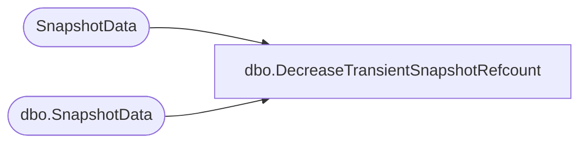

# dbo.DecreaseTransientSnapshotRefcount

**Database:** ReportServerWebIM  
**Server:** bedrockdb01  

## Architecture Diagram



## Table Dependencies

| Referenced Table |
|---|
| SnapshotData |
| dbo.SnapshotData |

## Stored Procedure Code

```sql
CREATE PROCEDURE [dbo].[DecreaseTransientSnapshotRefcount]
@SnapshotDataID as uniqueidentifier,
@IsPermanentSnapshot as bit
AS
SET NOCOUNT OFF
if @IsPermanentSnapshot = 1
BEGIN
   UPDATE SnapshotData
   SET TransientRefcount = TransientRefcount - 1
   WHERE SnapshotDataID = @SnapshotDataID
END ELSE BEGIN
   UPDATE [ReportServerWebIMTempDB].dbo.SnapshotData
   SET TransientRefcount = TransientRefcount - 1
   WHERE SnapshotDataID = @SnapshotDataID
END
```

