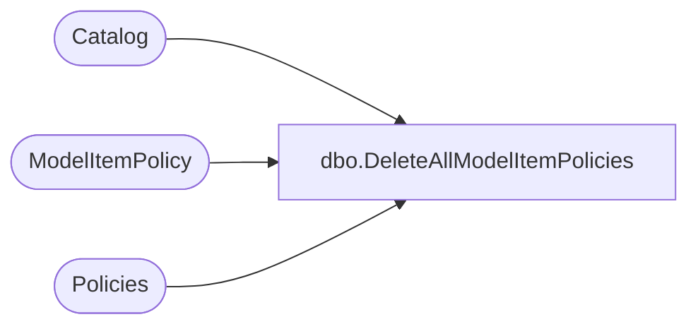

# dbo.DeleteAllModelItemPolicies

**Database:** ReportServerWebIM  
**Server:** bedrockdb01  

## Architecture Diagram



## Table Dependencies

| Referenced Table |
|---|
| Catalog |
| ModelItemPolicy |
| Policies |

## Stored Procedure Code

```sql
CREATE PROCEDURE [dbo].[DeleteAllModelItemPolicies]
@Path as nvarchar(450)
AS 

DELETE Policies
FROM
   Policies AS P
   INNER JOIN ModelItemPolicy AS MIP ON P.PolicyID = MIP.PolicyID
   INNER JOIN Catalog AS C ON MIP.CatalogItemID = C.ItemID
WHERE
   C.[Path] = @Path
```

