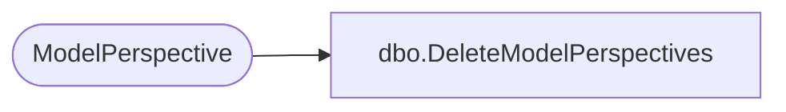

# dbo.DeleteModelPerspectives

**Database:** ReportServerWebIM  
**Server:** bedrockdb01  

## Architecture Diagram



## Table Dependencies

| Referenced Table |
|---|
| ModelPerspective |

## Stored Procedure Code

```sql
CREATE PROCEDURE [dbo].[DeleteModelPerspectives]
@ModelID as uniqueidentifier
AS

DELETE
FROM [ModelPerspective]
WHERE [ModelID] = @ModelID
```

