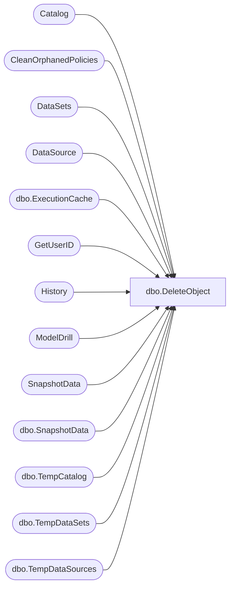

# dbo.DeleteObject

**Database:** ReportServerWebIM  
**Server:** bedrockdb01  

## Architecture Diagram



## Table Dependencies

| Referenced Table |
|---|
| Catalog |
| CleanOrphanedPolicies |
| DataSets |
| DataSource |
| dbo.ExecutionCache |
| GetUserID |
| History |
| ModelDrill |
| SnapshotData |
| dbo.SnapshotData |
| dbo.TempCatalog |
| dbo.TempDataSets |
| dbo.TempDataSources |

## Stored Procedure Code

```sql
CREATE PROCEDURE [dbo].[DeleteObject]
@Path nvarchar (425),
@Prefix nvarchar (850),
@EditSessionID varchar(32) = NULL,
@OwnerSid as varbinary(85) = NULL, 
@OwnerName as nvarchar(260) = NULL,
@AuthType int
AS

SET NOCOUNT OFF

IF(@EditSessionID is null)
BEGIN
-- Remove reference for intermediate formats
UPDATE SnapshotData
SET PermanentRefcount = PermanentRefcount - 1,
    -- to fix VSTS 384486 keep shared dataset compiled definition for 14 days
    ExpirationDate = case when R.Type = 8 then DATEADD(d, 14, GETDATE()) ELSE ExpirationDate END,
    TransientRefcount = TransientRefcount + case when R.Type = 8 then 1 ELSE 0 END
FROM
   Catalog AS R WITH (XLOCK)
   INNER JOIN [SnapshotData] AS SD ON R.Intermediate = SD.SnapshotDataID
WHERE
   (R.Path = @Path OR R.Path LIKE @Prefix ESCAPE '*')

-- Remove reference for execution snapshots
UPDATE SnapshotData
SET PermanentRefcount = PermanentRefcount - 1
FROM
   Catalog AS R WITH (XLOCK)
   INNER JOIN [SnapshotData] AS SD ON R.SnapshotDataID = SD.SnapshotDataID
WHERE
   (R.Path = @Path OR R.Path LIKE @Prefix ESCAPE '*')

-- Remove history for deleted reports and linked report
DELETE History
FROM
   [Catalog] AS R
   INNER JOIN [History] AS S ON R.ItemID = S.ReportID
WHERE
   (R.Path = @Path OR R.Path LIKE @Prefix ESCAPE '*')
   
-- Remove model drill reports
DELETE ModelDrill
FROM
   [Catalog] AS C
   INNER JOIN [ModelDrill] AS M ON C.ItemID = M.ReportID
WHERE
   (C.Path = @Path OR C.Path LIKE @Prefix ESCAPE '*')
      

-- Adjust data sources
UPDATE [DataSource]
   SET
      [Flags] = [Flags] & 0x7FFFFFFD, -- broken link
      [Link] = NULL
FROM
   [Catalog] AS C
   INNER JOIN [DataSource] AS DS ON C.[ItemID] = DS.[Link]
WHERE
   (C.Path = @Path OR C.Path LIKE @Prefix ESCAPE '*')

-- Clean all data sources
DELETE [DataSource]
FROM
    [Catalog] AS R
    INNER JOIN [DataSource] AS DS ON R.[ItemID] = DS.[ItemID]
WHERE    
    (R.Path = @Path OR R.Path LIKE @Prefix ESCAPE '*')

        -- Adjust temp editsession data sources
        UPDATE [ReportServerWebIMTempDB].dbo.TempDataSources
           SET
              Flags = Flags & 0x7FFFFFFD, -- broken link
              Link = NULL
        FROM
           [Catalog] AS C
           INNER JOIN [ReportServerWebIMTempDB].dbo.TempDataSources AS DS ON C.[ItemID] = DS.Link
        WHERE
           (C.Path = @Path OR C.Path LIKE @Prefix ESCAPE '*')

-- Adjust shared datasets
UPDATE [DataSets]
   SET
      [LinkID] = NULL
FROM
   [Catalog] AS C
   INNER JOIN [DataSets] AS DS ON C.[ItemID] = DS.[LinkID]
WHERE
   (C.Path = @Path OR C.Path LIKE @Prefix ESCAPE '*')

-- Adjust temp shared datasets
UPDATE [ReportServerWebIMTempDB].dbo.TempDataSets
   SET
      [LinkID] = NULL
FROM
   [Catalog] AS C
   INNER JOIN [ReportServerWebIMTempDB].dbo.TempDataSets AS DS ON C.[ItemID] = DS.[LinkID]
WHERE
   (C.Path = @Path OR C.Path LIKE @Prefix ESCAPE '*')
   
-- Clean shared datasets
DELETE [DataSets]
FROM
    [Catalog] AS R
    INNER JOIN [DataSets] AS DS ON R.[ItemID] = DS.[ItemID]
WHERE    
    (R.Path = @Path OR R.Path LIKE @Prefix ESCAPE '*')


-- Update linked reports
UPDATE LR
   SET
      LR.LinkSourceID = NULL
FROM
   [Catalog] AS R INNER JOIN [Catalog] AS LR ON R.ItemID = LR.LinkSourceID
WHERE
   (R.Path = @Path OR R.Path LIKE @Prefix ESCAPE '*')
   AND
   (LR.Path NOT LIKE @Prefix ESCAPE '*')

-- Remove references for cache entries
UPDATE SN
SET
   PermanentRefcount = PermanentRefcount - 1
FROM
   [ReportServerWebIMTempDB].dbo.SnapshotData AS SN
   INNER JOIN [ReportServerWebIMTempDB].dbo.ExecutionCache AS EC on SN.SnapshotDataID = EC.SnapshotDataID
   INNER JOIN Catalog AS C ON EC.ReportID = C.ItemID
WHERE
   (Path = @Path OR Path LIKE @Prefix ESCAPE '*')
   
-- Clean cache entries for items to be deleted   
DELETE EC
FROM
   [ReportServerWebIMTempDB].dbo.ExecutionCache AS EC
   INNER JOIN Catalog AS C ON EC.ReportID = C.ItemID
WHERE
   (Path = @Path OR Path LIKE @Prefix ESCAPE '*')

-- Finally delete items
DELETE
FROM
   [Catalog]
WHERE
   (Path = @Path OR Path LIKE @Prefix ESCAPE '*')

EXEC CleanOrphanedPolicies
END
ELSE
BEGIN
        DECLARE @OwnerID uniqueidentifier
        EXEC GetUserID @OwnerSid, @OwnerName, @AuthType, @OwnerID OUTPUT
        
        -- Remove reference for intermediate formats
        UPDATE [ReportServerWebIMTempDB].dbo.SnapshotData
        SET PermanentRefcount = PermanentRefcount - 1
        FROM
           [ReportServerWebIMTempDB].dbo.TempCatalog AS R WITH (XLOCK)
           INNER JOIN [ReportServerWebIMTempDB].dbo.SnapshotData AS SD ON R.Intermediate = SD.SnapshotDataID
        WHERE
           R.ContextPath = @Path
           AND R.EditSessionID = @EditSessionID
           AND R.OwnerID = @OwnerID

        -- Clean all data sources
        DELETE [ReportServerWebIMTempDB].dbo.TempDataSources
        FROM
            [ReportServerWebIMTempDB].dbo.TempCatalog AS R
            INNER JOIN [ReportServerWebIMTempDB].dbo.TempDataSources AS DS ON R.TempCatalogID = DS.ItemID
        WHERE    
            R.ContextPath = @Path
            AND R.EditSessionID = @EditSessionID
            AND R.OwnerID = @OwnerID

		-- Clean shared data sets
        DELETE [ReportServerWebIMTempDB].dbo.TempDataSets
        FROM
            [ReportServerWebIMTempDB].dbo.TempCatalog AS R
            INNER JOIN [ReportServerWebIMTempDB].dbo.TempDataSets AS DS ON R.TempCatalogID = DS.ItemID
        WHERE    
            R.ContextPath = @Path
            AND R.EditSessionID = @EditSessionID
            AND R.OwnerID = @OwnerID
            
        -- Remove references for cache entries
        UPDATE SN
        SET
           PermanentRefcount = PermanentRefcount - 1
        FROM
           [ReportServerWebIMTempDB].dbo.SnapshotData AS SN
           INNER JOIN [ReportServerWebIMTempDB].dbo.ExecutionCache AS EC on SN.SnapshotDataID = EC.SnapshotDataID
           INNER JOIN [ReportServerWebIMTempDB].dbo.TempCatalog AS C ON EC.ReportID = C.TempCatalogID
        WHERE
           ContextPath = @Path
           AND C.EditSessionID = @EditSessionID
           AND C.OwnerID = @OwnerID
           
        -- Clean cache entries for items to be deleted   
        DELETE EC
        FROM
           [ReportServerWebIMTempDB].dbo.ExecutionCache AS EC
           INNER JOIN [ReportServerWebIMTempDB].dbo.TempCatalog AS C ON EC.ReportID = C.TempCatalogID
        WHERE
            ContextPath = @Path
            AND C.EditSessionID = @EditSessionID
            AND C.OwnerID = @OwnerID

        -- Finally delete items
        DELETE
        FROM
           [ReportServerWebIMTempDB].dbo.TempCatalog
        WHERE
            ContextPath = @Path
            AND EditSessionID = @EditSessionID
            AND OwnerID = @OwnerID
END
```

