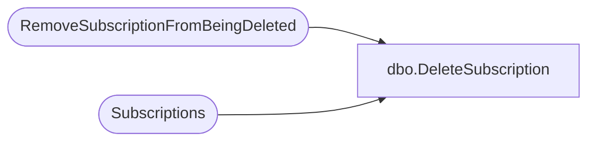

# dbo.DeleteSubscription

**Database:** ReportServerWebIM  
**Server:** bedrockdb01  

## Architecture Diagram



## Table Dependencies

| Referenced Table |
|---|
| RemoveSubscriptionFromBeingDeleted |
| Subscriptions |

## Stored Procedure Code

```sql
CREATE PROCEDURE [dbo].[DeleteSubscription] 
@SubscriptionID uniqueidentifier
AS
    -- Delete the subscription
    delete from [Subscriptions] where [SubscriptionID] = @SubscriptionID
    -- Delete it from the SubscriptionsBeingDeleted
    EXEC RemoveSubscriptionFromBeingDeleted @SubscriptionID
```

