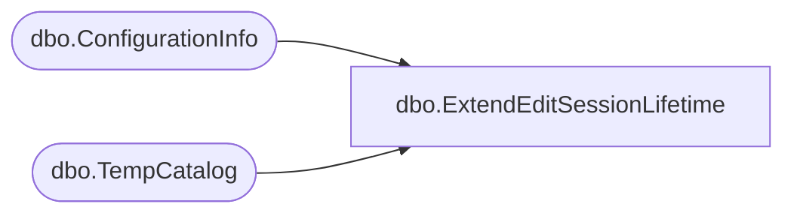

# dbo.ExtendEditSessionLifetime

**Database:** ReportServerWebIM  
**Server:** bedrockdb01  

## Architecture Diagram



## Table Dependencies

| Referenced Table |
|---|
| dbo.ConfigurationInfo |
| dbo.TempCatalog |

## Stored Procedure Code

```sql
CREATE PROC [dbo].[ExtendEditSessionLifetime]
    @EditSessionID varchar(32), 
    @Minutes int = NULL
AS
BEGIN
    if(@Minutes is null)
    begin
        declare @v nvarchar(max) ;
        select @v = convert(nvarchar(max), [Value]) from [dbo].[ConfigurationInfo] where [Name] = 'EditSessionTimeout' ;
        select @Minutes = convert(int, @v) / 60;  -- timeout stored in seconds
        
        if (@Minutes is null)
        begin
            select @Minutes = 120 ;
        end
        
        if(@Minutes < 1)
        begin
            select @Minutes = 1;
        end
    end
        
    update [ReportServerWebIMTempDB].dbo.TempCatalog
    set ExpirationTime = DATEADD(n, @Minutes, GETDATE()) 
    where EditSessionID = @EditSessionID ;
END

GRANT EXECUTE ON [dbo].[ExtendEditSessionLifetime] TO RSExecRole
```

