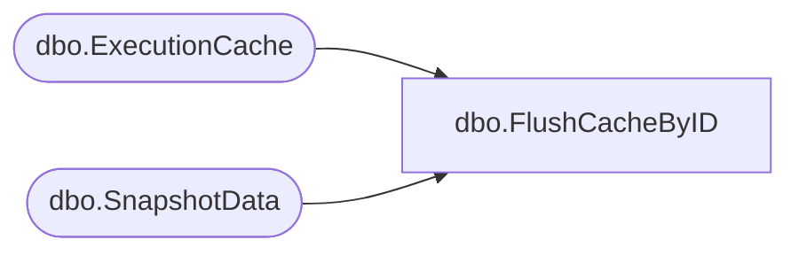

# dbo.FlushCacheByID

**Database:** ReportServerWebIM  
**Server:** bedrockdb01  

## Architecture Diagram



## Table Dependencies

| Referenced Table |
|---|
| dbo.ExecutionCache |
| dbo.SnapshotData |

## Stored Procedure Code

```sql
CREATE PROCEDURE [dbo].[FlushCacheByID]
@ItemID as uniqueidentifier
AS
BEGIN

DECLARE @AffectedSnapshots table (SnapshotDataID uniqueidentifier)

DELETE FROM [ReportServerWebIMTempDB].dbo.ExecutionCache
OUTPUT DELETED.SnapshotDataID into @AffectedSnapshots
WHERE ReportID = @ItemID

UPDATE [ReportServerWebIMTempDB].dbo.SnapshotData
SET PermanentRefcount = PermanentRefcount - 1
WHERE SnapshotDataID IN (SELECT SnapshotDataID FROM @AffectedSnapshots)

END
```

