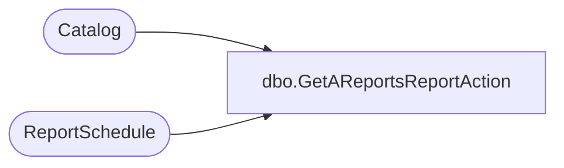

# dbo.GetAReportsReportAction

**Database:** ReportServerWebIM  
**Server:** bedrockdb01  

## Architecture Diagram



## Table Dependencies

| Referenced Table |
|---|
| Catalog |
| ReportSchedule |

## Stored Procedure Code

```sql
CREATE PROCEDURE [dbo].[GetAReportsReportAction]
@ReportID uniqueidentifier,
@ReportAction int
AS
select 
        RS.[ReportAction],
        RS.[ScheduleID],
        RS.[ReportID],
        RS.[SubscriptionID],
        C.[Path],
        C.[Type]
from
    [ReportSchedule] RS Inner join [Catalog] C on RS.[ReportID] = C.[ItemID]
where
    C.ItemID = @ReportID and RS.[ReportAction] = @ReportAction
```

