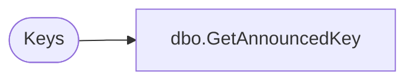

# dbo.GetAnnouncedKey

**Database:** ReportServerWebIM  
**Server:** bedrockdb01  

## Architecture Diagram



## Table Dependencies

| Referenced Table |
|---|
| Keys |

## Stored Procedure Code

```sql
CREATE PROCEDURE [dbo].[GetAnnouncedKey]
@InstallationID uniqueidentifier
AS

select PublicKey, MachineName, InstanceName
from Keys
where InstallationID = @InstallationID and Client = 1
```

