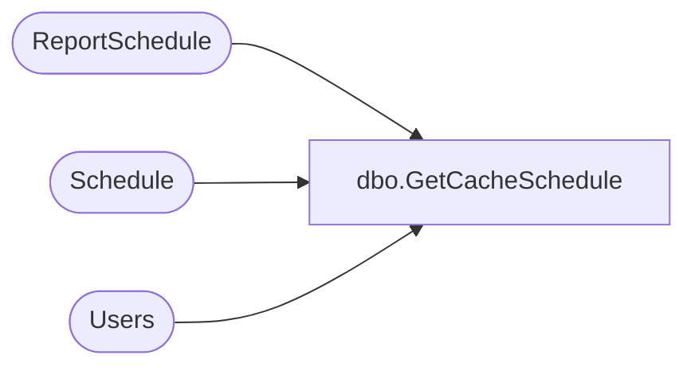

# dbo.GetCacheSchedule

**Database:** ReportServerWebIM  
**Server:** bedrockdb01  

## Architecture Diagram



## Table Dependencies

| Referenced Table |
|---|
| ReportSchedule |
| Schedule |
| Users |

## Stored Procedure Code

```sql
CREATE PROCEDURE [dbo].[GetCacheSchedule] 
@ReportID uniqueidentifier
AS
SELECT
    S.[ScheduleID],
    S.[Name],
    S.[StartDate], 
    S.[Flags],
    S.[NextRunTime],
    S.[LastRunTime], 
    S.[EndDate], 
    S.[RecurrenceType],
    S.[MinutesInterval],
    S.[DaysInterval],
    S.[WeeksInterval],
    S.[DaysOfWeek], 
    S.[DaysOfMonth], 
    S.[Month], 
    S.[MonthlyWeek], 
    S.[State], 
    S.[LastRunStatus],
    S.[ScheduledRunTimeout],
    S.[EventType],
    S.[EventData],
    S.[Type],
    S.[Path],
    SUSER_SNAME(Owner.[Sid]),
    Owner.[UserName],
    Owner.[AuthType],
    RS.ReportAction
FROM
    Schedule S with (XLOCK) inner join ReportSchedule RS on S.ScheduleID = RS.ScheduleID
    inner join [Users] Owner on S.[CreatedById] = Owner.[UserID]
WHERE
    (RS.ReportAction = 1 or RS.ReportAction = 3) and -- 1 == UpdateCache, 3 == Invalidate cache
    RS.[ReportID] = @ReportID
```

