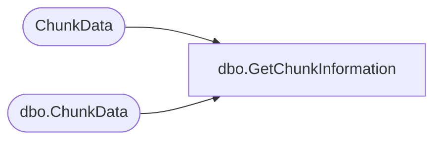

# dbo.GetChunkInformation

**Database:** ReportServerWebIM  
**Server:** bedrockdb01  

## Architecture Diagram



## Table Dependencies

| Referenced Table |
|---|
| ChunkData |
| dbo.ChunkData |

## Stored Procedure Code

```sql
CREATE PROCEDURE [dbo].[GetChunkInformation]
@SnapshotDataID uniqueidentifier,
@IsPermanentSnapshot bit,
@ChunkName nvarchar(260),
@ChunkType int
AS
IF @IsPermanentSnapshot != 0 BEGIN

    SELECT
       MimeType
    FROM
       ChunkData AS CH WITH (HOLDLOCK, ROWLOCK)
    WHERE
       SnapshotDataID = @SnapshotDataID AND
       ChunkName = @ChunkName AND
       ChunkType = @ChunkType      
       
END ELSE BEGIN

    SELECT
       MimeType
    FROM
       [ReportServerWebIMTempDB].dbo.ChunkData AS CH WITH (HOLDLOCK, ROWLOCK)
    WHERE
       SnapshotDataID = @SnapshotDataID AND
       ChunkName = @ChunkName AND
       ChunkType = @ChunkType      

END
```

