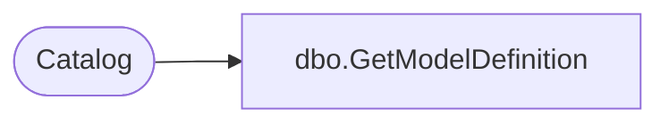

# dbo.GetModelDefinition

**Database:** ReportServerWebIM  
**Server:** bedrockdb01  

## Architecture Diagram



## Table Dependencies

| Referenced Table |
|---|
| Catalog |

## Stored Procedure Code

```sql
CREATE PROCEDURE [dbo].[GetModelDefinition]
@CatalogItemID as uniqueidentifier
AS

SELECT
    C.[Content]
FROM
    [Catalog] AS C
WHERE
    C.[ItemID] = @CatalogItemID
```

