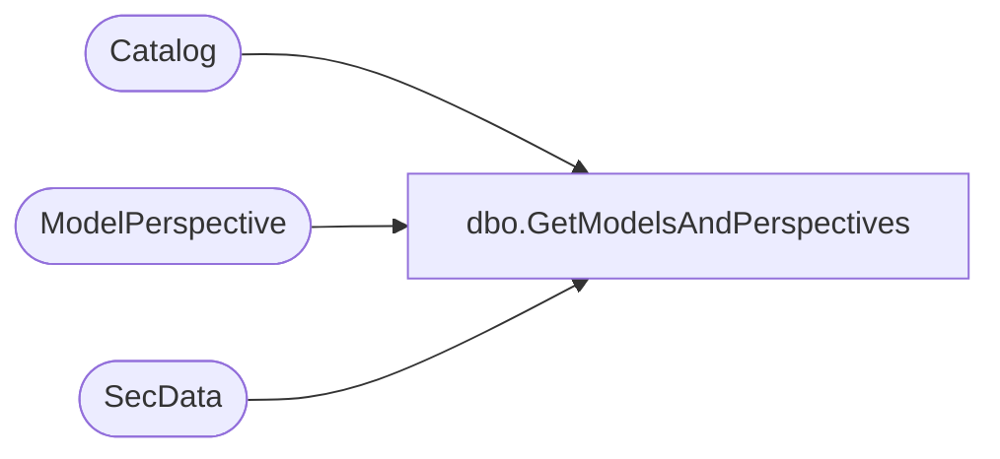

# dbo.GetModelsAndPerspectives

**Database:** ReportServerWebIM  
**Server:** bedrockdb01  

## Architecture Diagram



## Table Dependencies

| Referenced Table |
|---|
| Catalog |
| ModelPerspective |
| SecData |

## Stored Procedure Code

```sql
CREATE PROCEDURE [dbo].[GetModelsAndPerspectives]
@AuthType int,
@SitePathPrefix nvarchar(520) = '%'
AS

SELECT
    C.[PolicyID],
    SD.[NtSecDescPrimary],
    C.[ItemID],
    C.[Path],
    C.[Description],
    P.[PerspectiveID],
    P.[PerspectiveName],
    P.[PerspectiveDescription]
FROM
    [Catalog] as C
    LEFT OUTER JOIN [ModelPerspective] as P ON C.[ItemID] = P.[ModelID]
    LEFT OUTER JOIN [SecData] AS SD ON C.[PolicyID] = SD.[PolicyID] AND SD.[AuthType] = @AuthType
WHERE
    C.Path like @SitePathPrefix AND C.[Type] = 6 -- Model
ORDER BY
    C.[Path]
```

